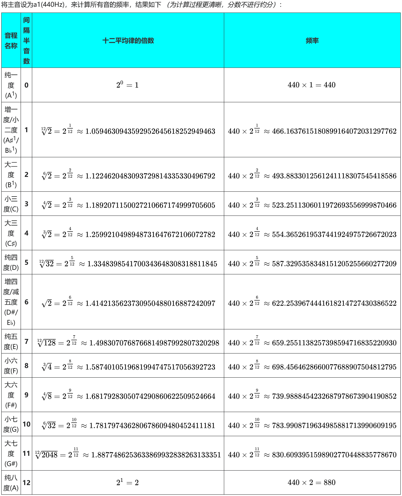

> 尽管本题有人工评测标记，本题由**评测机自动评测**。
> 
> 时间限制为 **$2$ 分钟**
> 
> 由于运行时间较长，**严禁故意频繁提交**；故意频繁提交导致服务器严重阻塞的，取消本题成绩。
> 
> 评测完成后，会通过邮件通知。

> 2026 年  5 月 20 日是南京大学124周年校庆。

为了庆祝建校，您需要使用 `pygame` 演奏一段南京大学校歌。

在本题中，您不应该把你的程序当成简单的一段代码，而是应该把它当作一个乐器。因此，您不应该引入任何外部的音频文件，而是应该单纯依靠计算来得到音频。

在初中物理中，我们学过“声是由物体振动产生的”，而在高中物理中，我们知道了简谐运动是一种典型的振动。

回顾正弦函数

$$
w(t) = A \sin(2 \pi f t)
$$

就刻画了一个简谐运动，振幅为 $A$，频率为 $f$。

因为在计算机中，一切都是离散的，所以在播放之前，还需对这个振动进行采样。我们定义采样频率 $F$，即一秒采样 $F$ 个点，于是就可以把一段时间内的振动变成存储到数组里，$\mathrm{arr}[i]=w(i/F)$。此外，这里的振幅也要求是一个 $16$ 位整数，因此可以取 $A = 32767$。这样，就可以利用 `numpy` 来计算出一段音频。

```python
pygame.mixer.init(frequency=48000, channels=2) #初始化音频格式
i = np.linspace(0, 1, 48000, endpoint=False) #生成横坐标
mono = np.array(32767 * np.sin(2 * np.pi * 440 * i), dtype=np.int16) #生成单声道波形
stero = np.column_stack((mono, mono)) #将两个单声道合成一个双声道
sound = pygame.mixer.Sound(audio) #播放pygame.time.wait(1000) #等待一秒，声音播放完成
```

上面的代码能够播放一段频率为 $440 \mathrm{Hz}$ 的音频一秒钟。

---

解决了播放声音的问题，下面就是播放旋律的问题。

南京大学校歌的简谱可以转写如下，

```python
[
"3*", "-", "-", "-",   "3", "-", "1", "-",    "5_", "-", "3", "-",    "5", "-", "4", "-",    "3", "-", None, "-",
"2", "-", "2", "-",     "1", "7_", "1", "-",  "3", "2", "2", "1",            "2", "-", "5_", "-",    "3", "-", "1", "-",
"5_", "1", "3", "-",   "5", "-", "4", "-",    "3", "-", "2", "-",        "2", "2", "3", "2",        "1", "7_", "1", "3",
"3", "-", "2", "1",       "2", "-", "1", "-",    "5", "5", "5", "5",            "6", "-", "5", "-",    "5", "-", "5", "-",
"5", "5", "5", "-",       "6", "-", "2", "-",    "#4", "-", "5", "-",      "3", "-", "1", "-",   "5_", "1", "3", "-",
"5", "-", "4", "-",     "3", "-", "2", "-",    "2", "-", "2", "-",        "1", "7_", "1","-",  "3", "-", "2","-",
"2", "-", "1","-",
]
```

其中，`1` $\sim$ `7` 的数字表示简谱上的音高，`#4` 表示 Fa-Sharp，即比 Fa 高一个半音；`x_` 表示 $x$ 降低一个八度，`x*` 表示 $x$ 升高一个八度。

下表是十二平均律，在这一题中，我们要求固定简谱中的 $1$ 为纯一度，即频率为 $440 \mathrm{Hz}$ 的声音，对应的 $2$ 为大二度，$3$ 为大三度，$4$ 为纯四度，$4^\#$ 为增四度，$5$ 为纯五度，$6$ 为大六度，$7$ 为大七度；升高或降低一个八度，即频率乘或除以 $2$。



于是，连续播放每个音符的声音就可以播放出歌曲。不过，您可能发现，直接播放时，在每个音的首尾会有咔咔声，这是因为首尾处正弦波被截断，局部形成了特殊的波形。在每个音的首尾添加淡入和淡出能有效改善这一问题；并且您会发现，线形窗听起来比较铿锵，而汉宁窗听起来更为悠扬。
